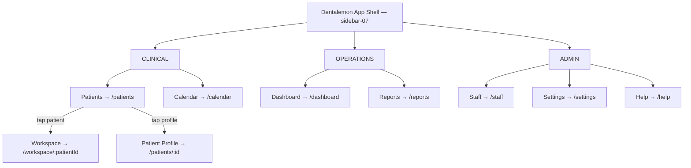

# Dentalemon — UI/UX Dev Handoff (8 modules, 24 deliverables)

## Introduction

Dentalemon is a dental-native, iPad-first practice management system for solo and small-group dental practices in the Philippines. This epic tracks the UI/UX implementation of all 8 core modules — the full Phase 1 product covering workspace, charting, scheduling, billing, reporting, staff management, onboarding, and auth.

Each module has its own directory with per-screen Markdown files containing wireframes, shadcn/ui component declarations, user stories, field specs, and explicit boundaries. Screens are ordered by workflow priority within each module.

**Platform strategy:** Web app first (Next.js + shadcn/ui), then converted to iPad app (PWA or native wrapper). All UI is designed for 1024px+ tablet landscape but built with web technologies.

## Tech Stack

| Layer | Technology |
|-------|-----------|
| Framework | Next.js (App Router) |
| UI Library | shadcn/ui |
| Styling | Tailwind CSS v4 |
| Icons | lucide-react + custom dental icon set |
| Charts | recharts (via shadcn Chart) |
| Fonts | Plus Jakarta Sans (headings), Inter (body), JetBrains Mono (clinical data) |
| Animation | Framer Motion |
| Min Viewport | 1024 × 768 (iPad landscape) |
| Data | Local-first (IndexedDB/SQLite via WASM), cloud backup sync |

### Custom Components (not in shadcn/ui)

> These are the two signature components that define Dentalemon's visual identity. Everything else is built from shadcn/ui primitives or lives as a sub-component inside these.

| Component | Description | Used In |
|-----------|-------------|---------|
| **Timeline Carousel** | Cover Flow + macOS Dock magnification hybrid — 3D perspective-tilted visit cards with proximity-based scaling, spring physics, swipe/drag gestures. Each card renders an **Interactive Dental Chart** (SVG anatomical teeth with per-surface state: amber=diagnosed, blue=treated; full-mouth, quadrant, and full-view modes; adult 32 teeth FDI 11-48, pediatric 20 teeth FDI 51-85; tappable per-tooth). Built with Framer Motion transforms + gesture handlers. | Module 1: Dental Workspace |
| **Patient Folder Card** | Custom SVG folder-shaped card resembling a medical file folder. Tab/flap at top with patient photo (or placeholder avatar) and decorative document lines. Body shows: last name, first name + initial, gender icon + age, status badge (Active/Pending/etc.) + date, overflow menu (⋮). Rendered as a responsive card grid. | Module 2: Patient Management |

### Composite Patterns (built from shadcn/ui primitives)

| Pattern | Build From | Used In |
|---------|-----------|---------|
| Tooth Slideout Panel | Sheet (side=right, 320px) + custom resize behavior (workspace shrinks, not overlay). 3px amber left accent. Contains adaptive wizard. | Module 1: Dental Workspace |
| Breakdown Table | Table + Checkbox + DropdownMenu (overflow ⋯) + custom row formatting (₱ price, status) | Module 1: Dental Workspace |
| Adaptive Wizard Stepper | Custom stepper (3 or 4 steps based on record state), step indicators, Back/Save & Continue footer | Module 1: Dental Workspace (Slideout) |
| Condition Card Stack | Card + Button (trash icon) + Badge (surface labels + condition), stackable list | Module 1: Dental Workspace (Slideout Step 1) |
| Treatment Plan Selector | Select with grouped options (specialty sections: ORTHO, ENDO, PERIO, PROSTHO, ORAL, PEDIA, COSMETIC) | Module 1: Dental Workspace (Slideout Step 2) |
| 5-Surface Selector | SVG interactive BMDIP tooth surface diagram (Buccal, Mesial, Distal, Incisal, Palatal) with cervical mode toggle. When toggled ON, cervical zones (gum-line region) become selectable alongside standard surfaces. Multi-select with visual highlighting (amber=diagnosed, blue=treated). | Module 1: Dental Workspace (Slideout Step 1) |
| Payment Modal | Dialog + Card (invoice header) + Card stack (applied payments) + alert bar (remaining balance) + form (add payment) + Button group (receipt actions) | Module 1: Dental Workspace |

### ShadCN Blocks Used

| Block | Category | Used In | Notes |
|-------|----------|---------|-------|
| `sidebar-07` | Sidebar | Navigation Shell (non-workspace screens) | Floating panel sidebar for Patient List, Calendar, Reports, Settings, Staff, Help. Warm cream background. |
| `dashboard-01` | Dashboard | Analytics Dashboard (Module 4) | Customized: added Tabs (period toggle), Badge trend indicators, Alert tier gate. Stock Card + Chart components modified. |

### ShadCN Charts Inventory

| Chart Type | Modules | Purpose |
|------------|---------|---------|
| Line | Module 4: Reporting | Revenue trends over time (weekly/monthly/quarterly) |
| Bar | Module 4: Reporting | Top treatments by frequency and revenue |
| Pie | Module 4: Reporting | Revenue breakdown by payment method (Cash, Credit Card, Bank Transfer, etc.) |

## Product Context

### Why This Exists

No dental-native practice management system exists in the Philippine market. Dentrix — the most feature-complete dental software globally — is blocked from the Philippines due to IRS system linkage. Every Philippine competitor (MyMeds, MYCURE, Mediks, Molarsoft) is a general clinic management system adapted for dental use. Dentists compensate with workarounds: hiring extra staff, maintaining parallel paper records, and memorizing patient charts because their software has no search function.

Dentalemon fills the Dentrix-shaped gap with a purpose-built system: dental-native charting (the #1 purchase driver), an iPad-first workspace with Apple-quality UX, and a stand-alone license with no recurring subscription. The revolutionary timeline carousel — inspired by Apple's Cover Flow and macOS Dock — makes browsing dental records a delightful experience, not a clinical chore.

### Phase Roadmap

| Phase | Scope | New Personas | Key Additions |
|-------|-------|-------------|---------------|
| **1 — Core Product** ← *you are here* | Solo/Practice end-to-end | Software Switcher (SW), Paper-Pending (PP) | Charting, scheduling, billing, debt tracking, reporting, prescriptions, cloud backup |
| **2 — Growth** | Group tier + web + integrations | Small Group Practice (GP) | Per-dentist workspace, desktop/web, GCash/Maya integration, patient reminders |
| **3 — Scale** | Multi-location + expansion | Enterprise | Multi-location management, advanced analytics, Android tablet |

### Key Constraints for Dev

| Constraint | Detail |
|------------|--------|
| Local-first architecture | All data stored on-device (IndexedDB/SQLite via WASM). Cloud is backup, not source. App works fully offline — airplane mode must support complete patient sessions. |
| PRC license validation | Dentist profiles require a validated PRC license number. Prescriptions must display the prescribing dentist's PRC number and signature. |
| FDI tooth notation | Adult: 32 teeth numbered 11-48. Pediatric: 20 teeth numbered 51-85. Both dentitions must be supported per patient. |
| Offline-first clinical workflows | Charting, patient records, scheduling, billing, payment recording, and reporting must work without internet. Sync on reconnect (last-write-wins + audit log). |
| Data privacy (RA 10173) | DPA 2012 compliance. Encryption at rest and in transit. Consent at registration. Full data export always available. |
| PWD/Senior discount | Automatic discount application per RA 7277 (PWD) and RA 9994 (Senior Citizens). Visible as line item on invoices. |
| Stand-alone license model | One-time purchase, permanent ownership. No subscription for core product. License tiers: Solo, Practice, Group. |
| Workspace never-navigate rule | During active patient care, the dentist must NEVER leave the workspace screen. All clinical interactions are overlays (modals, slideouts, sheets) on the workspace. |
| iPad conversion target | Web app will be wrapped for iPad distribution. All touch targets ≥ 44px. No hover-only interactions. Gestures (swipe, pinch) must work on touch. |

## App Shell

Dentalemon uses a **dual-shell architecture**:

1. **Navigation Shell** — `sidebar-07` (floating panel) for non-clinical screens (Patient List, Calendar, Reports, Settings, Staff). Warm cream background (`#FAFAF8`), navy text, amber accents.

2. **Workspace Shell** — custom full-screen layout for clinical work. No sidebar, no tab bar. Three zones stacked vertically:
   - **Top Bar** (56px): Patient dropdown (left) + "Today's Baseline - [Date]" picker (center) + 4 action icons (right: Prescriptions, Consent Forms, Attachments | divider | Full/Quadrant view toggle)
   - **Timeline Carousel** (center): Cover Flow dental chart carousel with Dock-style magnification
   - **Breakdown Table** (bottom): Treatment rows with column headers (Tooth, Surface, Condition, Treatment Plan, Work Done, Status, Total) + Grand Total + "Continue to Payment" CTA

Transition: Patient List → tap patient → Workspace Shell opens (full-screen takeover). Workspace → close/back → returns to Navigation Shell.

### Sidebar Navigation

| Group | Menu Item | Parent | Route | Module | Icon |
|-------|-----------|--------|-------|--------|------|
| CLINICAL | Patients | — | `/patients` | Module 2: Patient Management | `Users` |
| | Calendar | — | `/calendar` | Module 3: Scheduling | `Calendar` |
| OPERATIONS | Dashboard | — | `/dashboard` | Module 4: Reporting & Analytics | `BarChart3` |
| | Reports | — | `/reports` | Module 4: Reporting & Analytics | `FileText` |
| ADMIN | Staff | — | `/staff` | Module 5: Staff Management | `UserCog` |
| | Settings | — | `/settings` | Module 7: Settings | `Settings` |
| | Help | — | `/help` | Module 6: Onboarding | `HelpCircle` |

### Orphaned Screens (no sidebar entry)

| Screen | Route | Reached From | How |
|--------|-------|-------------|-----|
| Dental Workspace | `/workspace/:patientId` | Patient List | Tap patient row → full-screen takeover |
| Patient Profile | `/patients/:id` | Patient List | Tap patient row (non-workspace context) |
| Onboarding Wizard | `/onboarding` | App launch | First-time setup (no prior data) |
| Data Import | `/onboarding/import` | Onboarding Wizard | "Migrating from another system" path |
| Login | `/login` | App launch | Unauthenticated state |

### Navigation Diagram

### Responsive Behavior

| Viewport | Layout |
|----------|--------|
| ≥ 1024px (iPad landscape) | Full sidebar (expanded) + content area. Workspace: full-screen 3-zone layout. |
| 768-1023px (iPad portrait) | Collapsed sidebar (icon-only) + content area. Workspace: stacked layout (carousel shrinks). |
| < 768px | Not supported — tablet-first, no phone layout. |

## Design Tokens

| Token | Hex | Usage |
|-------|-----|-------|
| Primary | `#FFCC5E` | CTAs, accents, highlights, active stepper steps |
| Primary Text (on yellow) | `#461402` | Button text on yellow backgrounds — NEVER white |
| Navy | `#1E3A5F` | Text, headers, primary contrast (10.5:1 AAA) |
| Teal | `#4A6B7A` | UI accents, body text (4.5:1 AA) |
| Success | `#22C55E` | Completion states, paid badges, green checkmarks |
| Warning | `#F59E0B` | Alerts, remaining balance bar (dark text only) |
| Error / Destructive | `#EF4444` | Errors, destructive actions (Remove) |
| Info | `#3B82F6` | Information states |
| Background | `#FAFAF8` | Warm cream page background |
| Surface | `#FFFFFF` | Cards, modals, elevated surfaces |
| Brand tokens | [`brand/brand-tokens.md`](../brand/brand-tokens.md) | Full color system, typography, animation, voice |

## Build Sequence

| Tier | Modules | Priority |
|------|---------|----------|
| **1 — Core Clinical** | Module 1: Dental Workspace, Module 2: Patient Management | The workspace IS the product. Patient management feeds it. Build these first. |
| **2 — Operations** | Module 3: Scheduling, Module 4: Reporting & Analytics | Complete the daily workflow loop: see patients → schedule next → review day. |
| **3 — Admin & Setup** | Module 5: Staff Management, Module 6: Onboarding, Module 7: Settings, Module 8: Auth | Supporting infrastructure. Auth is technically first-run but design-last (simple). |

## Modules

| Tier | Module | Screens | Directory |
|------|--------|---------|-----------|
| 1 | Dental Workspace | 10 | [module-1-workspace/](module-1-workspace/) |
| 1 | Patient Management | 4 | [module-2-patients/](module-2-patients/) |
| 2 | Scheduling | 2 | [module-3-scheduling/](module-3-scheduling/) |
| 2 | Reporting & Analytics | 2 | [module-4-reporting/](module-4-reporting/) |
| 3 | Staff Management | 1 | [module-5-staff/](module-5-staff/) |
| 3 | Onboarding | 3 | [module-6-onboarding/](module-6-onboarding/) |
| 3 | Settings | 1 | [module-7-settings/](module-7-settings/) |
| 3 | Auth | 1 | [module-8-auth/](module-8-auth/) |

## PRD Deviations

| PRD Requirement | Handoff Decision | Rationale | Screen |
|-----------------|-----------------|-----------|--------|
| FR1.7: Dual footer totals (Estimated + Checkout) | Single "Continue to Payment" CTA | Hi-fi mockup simplification; Grand Total row serves estimated purpose | Dental Workspace |
| FR1: 4-step wizard always | 3 steps (no records) / 4 steps (with records) | Adaptive flow — Overview step only when tooth has history | Dental Workspace (Slideout) |
| FR1: Center label "Session · Date" | "Today's Baseline - [Date]" | Mockup branding |  Dental Workspace |
| FR1: Compact inline breakdown rows | Structured table with column headers | Mockup table design | Dental Workspace |
| FR1: Condition dropdown flat list | Grouped: WHOLE TOOTH / SURFACE | Improved clinical organization | Dental Workspace (Slideout) |
| FR1: Treatment dropdown nested filter | Grouped sections by specialty | Specialty-first organization | Dental Workspace (Slideout) |
| FR1: Static surface diagram | Live status indicator (amber→blue) | Real-time feedback | Dental Workspace (Slideout) |
| FR1: Review CTA "Save & Close" | "Finalize Plans" | Clearer intent labeling | Dental Workspace (Slideout) |
| FR1: Work Done ghost button | Checkbox column | Faster batch marking | Dental Workspace |
| FR1: Top bar icon 2 "Signatures" | "Consent Forms" | More accurate clinical term | Dental Workspace |

## Gap Resolutions Integrated

The following UX gaps were identified and resolved during the SMELT handoff session (2026-03-24). All resolutions are embedded in the relevant screen specs.

| Gap | Resolution | Screen |
|-----|-----------|--------|
| Missing/extracted teeth state on chart | Chart supports per-tooth state: missing (grayed), extracted (X marker) | Dental Workspace |
| Work Done undo | 5-second undo toast after checking Work Done | Dental Workspace |
| Close/patient-switch/date-picker discard guards | Confirmation dialog on unsaved wizard or payment state | Dental Workspace |
| Past baseline read-only mode | "Baseline" vs "Today's Baseline" label distinguishes read-only historical views | Dental Workspace |
| "Work on this tooth" redirect from past baselines | Link in past baseline view opens today's baseline with that tooth pre-selected | Dental Workspace |
| PWD/Senior inline toggles in Payment Modal | Toggle switches in Payment Modal apply discount as line item | Payment Modal |
| "In Session" badge on patient cards | Badge shown when patient has active workspace session | Patient List |
| Walk-in return flow | Auto-redirect from Calendar walk-in to Patient List with registration modal | Calendar, Patient List |
| Appointment edit + No-Show revert | Edit action on appointment + Revert No-Show button | Calendar |
| Cervical surface toggle | Switch on 5-surface selector enables cervical zone selection | Slideout — Condition |
| Archive with confirmation + Archived filter + Restore | Archive action on patient cards, Archived filter tab, Restore from archive | Patient List |
| Schedule Next Visit overlay in workspace (FR6.4) | Post-payment overlay opens New Appointment modal within workspace | Dental Workspace, Calendar |
| Treatment History Modal filters | Status, date, and tooth filters on treatment history view | Treatment History Modal |
| Security question for PIN recovery | Set during onboarding Step 2; used for dentist-owner PIN recovery on login | Onboarding Wizard, Login |
| Auto-send receipt wiring (FR14.1) | Receipt actions (Print, Email, SMS) in Payment Modal post-completion | Payment Modal |

## Export Snapshot

| Field | Value |
|-------|-------|
| Exported | 2026-03-24 |
| Export path | `products/health/dentalemon/handoff/` |
| Screens | 24 |
| Wireframes | 15 XML + 9 inline ASCII |
| Modules | 8 |

> Any changes to screen comments on GitHub after 2026-03-24 are NOT reflected in this handoff directory. Re-run SMELT Direction C to update.

## References

| Resource | Location |
|----------|----------|
| Original PRD | [`docs/PRD.md`](../docs/PRD.md) |
| Brand Tokens | [`brand/brand-tokens.md`](../brand/brand-tokens.md) |
| Design Spec Addendum | [`addendum-design-specs.md`](addendum-design-specs.md) |
| Dental Chart Reference | [`dentalchart/DENTAL_CHART_REFERENCE.md`](../dentalchart/DENTAL_CHART_REFERENCE.md) |
