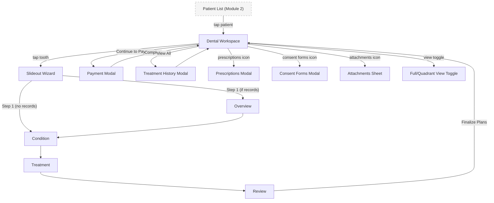

## Introduction

**Module 1: Dental Workspace** — Build Tier 1 (Core Clinical)

The dental workspace is the single screen where the dentist spends their entire patient session — charting, diagnosing, treating, billing, and documenting without ever navigating away. It is the product's revolutionary interaction model and the primary differentiator from every Philippine competitor. The workspace owns the treatment lifecycle (Proposed → Done → Paid) and the patient's clinical timeline. Downstream modules (Patient Management, Scheduling, Reporting) consume data created here.

### Personas

| Persona | Access Level | Primary Screens |
|---------|-------------|-----------------|
| Dentist-Owner (SW/PP) | Full CRUD — all workspace interactions, payment processing, prescriptions, consent forms | Dental Workspace, all slideout steps, all modals |
| Staff / Secretary | Read-only workspace view + payment recording (Practice tier only) | Dental Workspace (view), Payment Modal (record payments) |

### Key Regulations

- **PRC Regulations** (Professional Regulation Commission): Prescriptions generated from the workspace must display the prescribing dentist's PRC license number and signature.
- **RA 7277 / RA 9994** (PWD Act / Senior Citizens Act): Automatic discount application when patient is flagged as PWD or senior citizen. Discount visible as line item on invoices generated from the Payment Modal.
- **RA 10173** (Data Privacy Act 2012): Patient clinical records encrypted at rest. Consent at collection.

## Screen Inventory

| # | Screen | Route | Spec | Wireframe |
|---|--------|-------|------|-----------|
| 1 | Dental Workspace | `/workspace/:patientId` | [screen-dental-workspace.md](screen-dental-workspace.md) | [wireframes/dental-workspace.xml](wireframes/dental-workspace.xml) |

### Collapsed into Parent Screens (not counted)

| Screen | Classification | Parent | Spec | Wireframe |
|--------|---------------|--------|------|-----------|
| Slideout: Overview | Step (wizard step 1 — conditional, shown only when tooth has records) | Dental Workspace | [step-slideout-overview.md](step-slideout-overview.md) | [wireframes/step-slideout-overview.xml](wireframes/step-slideout-overview.xml) |
| Slideout: Condition | Step (wizard step 1 or 2 — surface + condition assignment) | Dental Workspace | [step-slideout-condition.md](step-slideout-condition.md) | [wireframes/step-slideout-condition.xml](wireframes/step-slideout-condition.xml) |
| Slideout: Treatment | Step (wizard step 2 or 3 — treatment selection by specialty) | Dental Workspace | [step-slideout-treatment.md](step-slideout-treatment.md) | [wireframes/step-slideout-treatment.xml](wireframes/step-slideout-treatment.xml) |
| Slideout: Review | Step (wizard step 3 or 4 — summary + notes + finalize) | Dental Workspace | [step-slideout-review.md](step-slideout-review.md) | [wireframes/step-slideout-review.xml](wireframes/step-slideout-review.xml) |
| Payment Modal | Modal (triggered by "Continue to Payment" CTA) | Dental Workspace | [modal-payment.md](modal-payment.md) | [wireframes/modal-payment.xml](wireframes/modal-payment.xml) |
| Treatment History Modal | Modal (triggered by "View All" link in breakdown header) | Dental Workspace | [modal-treatment-history.md](modal-treatment-history.md) | inline-ascii |
| Prescriptions Modal | Modal (triggered by prescriptions icon in top bar) | Dental Workspace | [modal-prescriptions.md](modal-prescriptions.md) | [wireframes/modal-prescriptions.xml](wireframes/modal-prescriptions.xml) |
| Consent Forms Modal | Modal (triggered by consent forms icon in top bar) | Dental Workspace | [modal-consent-forms.md](modal-consent-forms.md) | [wireframes/modal-consent-forms.xml](wireframes/modal-consent-forms.xml) |
| Attachments Sheet | Modal (triggered by attachments icon in top bar) | Dental Workspace | [modal-attachments.md](modal-attachments.md) | inline-ascii |

## Done When

- [ ] Dental Workspace screen implemented with 3-zone layout (top bar + carousel + breakdown table)
- [ ] Timeline Carousel renders interactive dental charts with Cover Flow + Dock magnification behavior
- [ ] All 4 slideout wizard steps implemented with adaptive flow (3 steps no records, 4 steps with records)
- [ ] All 5 workspace modals/sheets implemented (Payment, Treatment History, Prescriptions, Consent Forms, Attachments)
- [ ] Breakdown table supports treatment lifecycle (Proposed → Done → Paid)
- [ ] Full-mouth, quadrant, and full-view chart modes functional
- [ ] Adult (32 teeth, FDI 11-48) and pediatric (20 teeth, FDI 51-85) dentitions supported
- [ ] Touch targets ≥ 44px for iPad conversion readiness
- [ ] Error, empty, and loading states implemented for all screens
- [ ] Screenshots added to each screen comment by dev

## Acceptance Criteria

**Dental Workspace — Patient Session:**
- GIVEN a dentist has selected a patient from the Patient List
- WHEN the workspace loads
- THEN the top bar shows patient name + "Today's Baseline - [date]", the carousel shows the active baseline chart in front with past baselines stacked behind, and the breakdown table shows any existing proposed treatments for this session

**Timeline Carousel — Navigation:**
- GIVEN a patient has multiple visit baselines
- WHEN the dentist swipes/drags across the carousel
- THEN nearby cards scale up (Dock magnification), the focal card enlarges with 3D perspective, and past cards show historical chart state (read-only)

**Slideout Wizard — No Records Path:**
- GIVEN a tooth has no existing records
- WHEN the dentist taps the tooth on the chart
- THEN a 3-step wizard opens (Condition → Treatment → Review) in the right slideout panel

**Slideout Wizard — Has Records Path:**
- GIVEN a tooth has existing treatment records
- WHEN the dentist taps the tooth on the chart
- THEN a 4-step wizard opens (Overview → Condition → Treatment → Review) showing recent records on the Overview step

**Condition Step — Multi-Surface Assignment:**
- GIVEN the dentist is on the Condition step
- WHEN they select surfaces on the 5-surface diagram and pick a condition from the grouped dropdown
- THEN a condition card appears (e.g., "M, D · Caries") that is deletable, and additional surface-condition pairs can be stacked

**Treatment Step — Specialty Filtering:**
- GIVEN conditions have been assigned
- WHEN the dentist advances to the Treatment step
- THEN each condition card shows a treatment dropdown grouped by dental specialty (ORTHO, ENDO, PERIO, etc.)

**Review Step — Finalize:**
- GIVEN all conditions have treatments assigned
- WHEN the dentist taps "Finalize Plans"
- THEN summary cards appear with per-card "Record Note" fields, and on confirm, treatment rows are added to the breakdown table with auto-filled prices from the fee schedule

**Breakdown Table — Work Done:**
- GIVEN treatment rows exist in the breakdown table
- WHEN the dentist checks the "Work Done" checkbox on a row
- THEN the row moves to the completed pool and the "Continue to Payment" CTA appears (if not already visible)

**Payment Modal:**
- GIVEN completed treatments exist
- WHEN the dentist taps "Continue to Payment"
- THEN a payment modal opens showing: invoice header (auto-numbered), applied payments list, remaining balance bar, add payment form (method + amount), "Generate Payment Link" button, receipt actions (Print, Email, SMS), and "Complete" button

## Tech Notes

- **Timeline Carousel:** Built with Framer Motion. Use `useMotionValue` + `useTransform` for proximity-based scaling. 3D perspective via CSS `transform: perspective() rotateY()`. Spring physics for deceleration (`type: "spring", stiffness: 300, damping: 30`). Each card is a React component wrapping the SVG dental chart. **Full animation spec:** See [`addendum-design-specs.md`](../addendum-design-specs.md) §1.1–1.8 for spring mass, Dock magnification curve, 3D transform values, card dimensions, snap behavior, and drag thresholds.
- **Dental Chart SVG:** Each tooth is an independent SVG group with click handler. Surface state is driven by per-tooth data (condition/treatment status → fill color). View mode toggle (full/quadrant/full-view) re-renders the SVG layout, not the individual teeth.
- **Slideout resize behavior:** The slideout is NOT a shadcn Sheet overlay. It resizes the workspace from ~100% to ~70% width. Implement as a flex layout with animated width transition, not a modal/overlay.
- **Treatment fee schedule:** Prices auto-populate from a configurable fee schedule (Settings module). Editable inline via overflow menu on each breakdown row.
- **Invoice numbering:** Auto-generated format `INV-YYYY-MMDD` (e.g., INV-2026-0312). Sequential within the clinic's data.
- **Offline-first:** All workspace interactions must work without internet. Treatment records, payments, and prescriptions are saved to local storage and synced when connectivity is restored.

## Scope Boundaries

**In scope:**
- Complete patient session workflow (chart → diagnose → treat → bill → document)
- Timeline carousel with Cover Flow + Dock magnification
- Interactive dental chart (full-mouth, quadrant, full-view modes)
- Adaptive slideout wizard (3/4 steps)
- Treatment breakdown table with lifecycle management
- Payment modal with multi-payment support
- Prescriptions, consent forms, and attachments overlays
- Adult and pediatric dentition support
- PWD/Senior discount application

**Out of scope (do NOT implement):**
- Appointment scheduling from workspace — deferred to Module 3 (FR6.4 "schedule next appointment" is a cross-module link, not built here)
- Patient registration — Module 2 owns patient creation
- Revenue reporting — Module 4 consumes workspace data
- Staff permission management — Module 5 defines roles; workspace enforces them
- Online payment processing (GCash/Maya) — Phase 2 (FR18). "Generate Payment Link" is a placeholder CTA in Phase 1.
- X-ray email integration — Phase 2 (Dentrix benchmark feature)
- Multi-dentist workspace — Phase 2 (FR16)

## Design Reference

- Hi-fi mockups shared during SMELT session (2026-03-24): workspace layout, wizard steps 1-3, payment modal, top bar icon mapping
- UI Codex (locked 2026-03-09): `dentalemon-workspace-ui.md` in auto memory — canonical component names, layout zones, overlay specs, interaction patterns
- Brand tokens: `products/health/dentalemon/brand/brand-tokens.md`
- **Mockup is authoritative** where it conflicts with PRD or UI Codex

---

## Navigation

### Workspace Shell (custom — no sidebar)

The workspace has NO sidebar or tab bar entry. It is reached by selecting a patient from the Patient List (Module 2). The workspace takes over the full screen with its own 3-zone layout.

| Entry Point | Route | From Module | How |
|-------------|-------|-------------|-----|
| Dental Workspace | `/workspace/:patientId` | Module 2: Patient Management | Tap patient card → full-screen takeover |

> Exit: close/back button returns to Patient List.

---

## Screen Flow Diagram

---

## Cross-Module Screen References

| Screen in This Module | References Screen | In Module | How |
|-----------------------|-------------------|-----------|-----|
| Dental Workspace | Patient List | Module 2: Patient Management | Back/close returns to Patient List |
| Dental Workspace | Patient Profile | Module 2: Patient Management | Patient dropdown may link to full profile |
| Payment Modal | Revenue Reports | Module 4: Reporting & Analytics | Payment data consumed by reporting |
| Dental Workspace | Calendar (Check In) | Module 3: Scheduling | Check-in from calendar opens workspace |
| Breakdown Table | Settings (fee schedule) | Module 7: Settings | Treatment prices auto-fill from fee schedule |
| Payment Modal (post-Complete) | New Appointment modal | Module 3: Scheduling | "Schedule Next Visit" overlay opens appointment modal within workspace (FR6.4) |
