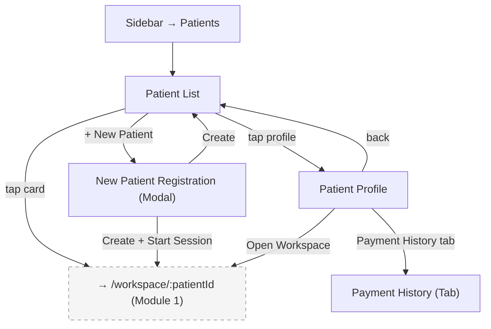

## Introduction

**Module 2: Patient Management** — Build Tier 1 (Core Clinical)

Patient Management is the entry point to all clinical work. It owns the patient registry (create, search, browse), patient profiles (demographics, dental history, debt status), and payment history. The Patient List is the home screen — every session starts here. Tapping a patient card opens the Dental Workspace (Module 1). Debt tracking (FR5) is the #1 named pain point across research participants.

### Personas

| Persona | Access Level | Primary Screens |
|---------|-------------|-----------------|
| Dentist-Owner (SW/PP) | Full CRUD — create patients, view profiles, record payments, manage balances | All screens |
| Staff / Secretary | Create + Read — register patients, search records, view profiles. Solo tier: scheduling + patient lookup only. Practice tier: full operational access except clinical notes and financial analytics. | Patient List, Patient Profile (limited), New Patient Registration |

### Key Regulations

- **RA 10173** (Data Privacy Act 2012): Patient personal information encrypted at rest. Consent at registration. Full data export (CSV/JSON) always available.
- **PRC Regulations**: PRC-related metadata stored per patient for prescription linkage (Module 1).

## Screen Inventory

| # | Screen | Route | Spec | Wireframe |
|---|--------|-------|------|-----------|
| 1 | Patient List | `/patients` | [screen-patient-list.md](screen-patient-list.md) | [wireframes/patient-list.xml](wireframes/patient-list.xml) |
| 2 | Patient Profile | `/patients/:id` | [screen-patient-profile.md](screen-patient-profile.md) | [wireframes/patient-profile.xml](wireframes/patient-profile.xml) |

### Collapsed into Parent Screens (not counted)

| Screen | Classification | Parent | Spec File |
|--------|---------------|--------|-----------|
| New Patient Registration | Modal (triggered by "+ New Patient" CTA) | Patient List | [modal-new-patient-registration.md](modal-new-patient-registration.md) |
| Payment History | Tab (of Patient Profile) | Patient Profile | [tab-payment-history.md](tab-payment-history.md) |

## Done When

- [ ] Patient List screen implemented with custom Patient Folder Cards in responsive grid
- [ ] Patient Profile screen implemented with demographics, dental history overview, and debt summary
- [ ] New Patient Registration modal with progressive field expansion
- [ ] Payment History tab with filterable history
- [ ] Search returns results in <1s with partial name matching
- [ ] Debt/balance tracking visible on patient profile with aging (current/30/60/90+ days)
- [ ] Role-based visibility applied per persona table
- [ ] Error, empty, and loading states implemented
- [ ] Screenshots added to each screen comment by dev

## Acceptance Criteria

**Patient List — Search:**
- GIVEN the dentist is on the Patient List
- WHEN they type a partial name in the search field
- THEN matching patient cards appear in <1s with highlighted match text

**Patient List — Open Workspace:**
- GIVEN a patient card is displayed
- WHEN the dentist taps the card
- THEN the Dental Workspace (Module 1) opens for that patient in full-screen takeover

**New Patient Registration:**
- GIVEN the dentist taps "+ New Patient"
- WHEN the registration modal opens
- THEN minimal required fields are shown first (name, contact, birthdate) with optional fields expandable. Registration completable in <2 minutes.

**Patient Profile — Debt Summary:**
- GIVEN a patient has outstanding balances
- WHEN the dentist views their profile
- THEN the total owed, last payment date, and aging breakdown (current/30/60/90+ days) are visible at a glance

**Payment History — Filtering:**
- GIVEN the dentist is on the Payment History tab
- WHEN they apply a date range filter
- THEN only payments within that range are shown with amount, method, and associated treatments

## Tech Notes

- **Patient Folder Card:** Custom SVG component (see epic Custom Components). Each card shows: patient photo/avatar, last name, first name + initial, gender icon + age, status badge (Active/Pending), date, overflow menu.
- **Search:** Local SQLite/IndexedDB full-text search. Index on name fields. Debounced input (300ms).
- **Duplicate detection:** On "Create Patient," run fuzzy name match against existing records. Warn before creating if match score > 80%.
- **Debt aging:** Calculated from invoice dates. Buckets: Current (0-29 days), 30 days, 60 days, 90+ days. Refresh on profile load.
- **Data export:** CSV/JSON export of all patient data available from profile. Per RA 10173 data portability.

## Scope Boundaries

**In scope:**
- Patient card grid with custom folder cards
- Search with partial name matching
- Patient profile with demographics, dental history overview, debt summary
- New patient registration with progressive disclosure
- Payment history with date range filtering
- Manual payment recording
- Overdue balance alerts
- Data export (CSV/JSON)

**Out of scope (do NOT implement):**
- Clinical charting or treatment management — that is Module 1: Dental Workspace
- Appointment scheduling from patient profile — that is Module 3: Scheduling
- Revenue reporting — that is Module 4: Reporting & Analytics
- Data migration/import wizard — that is Module 6: Onboarding (FR15)
- Patient-facing portal or self-service — not in Phase 1 scope

## Design Reference

- Hi-fi mockup of Patient Folder Card shared during SMELT session (2026-03-24)
- Brand tokens: `products/health/dentalemon/brand/brand-tokens.md`

---

## Navigation

### Sidebar (Navigation Shell)

| Menu Item | Route | Icon | Landing Screen |
|-----------|-------|------|----------------|
| Patients | `/patients` | `Users` | Patient List |

> Must match the Sidebar Navigation table in the epic.

---

## Screen Flow Diagram

---

## Cross-Module Screen References

| Screen in This Module | References Screen | In Module | How |
|-----------------------|-------------------|-----------|-----|
| Patient List | Dental Workspace | Module 1: Dental Workspace | Tap patient card → workspace opens |
| Patient Profile | Dental Workspace | Module 1: Dental Workspace | "Open Workspace" CTA |
| Patient Profile | Calendar | Module 3: Scheduling | "View Appointments" link shows patient's scheduled appointments |
| Payment History | Payment Modal | Module 1: Dental Workspace | Payment data created in workspace flows into payment history |
| Patient List | Calendar (Walk-In) | Module 3: Scheduling | Walk-in flow routes to Patient List with registration modal |
| Patient List | Revenue Reports | Module 4: Reporting & Analytics | Debt data aggregated into revenue reports |
| Patient List | Onboarding (post-setup) | Module 6: Onboarding | Onboarding wizard completes → redirects to Patient List |
| Patient List | Login (post-auth) | Module 8: Auth | Successful login → redirects to Patient List |
