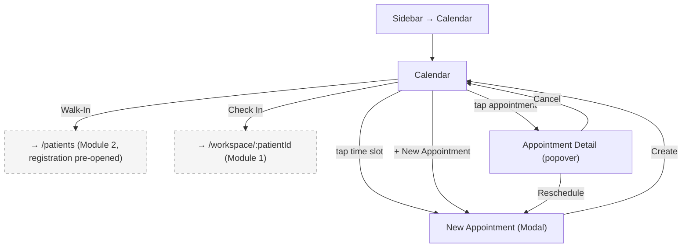

## Introduction

**Module 3: Scheduling** — Build Tier 2 (Operations)

Scheduling is the operational backbone — the dentist's daily planner. It owns the appointment calendar (day/week/month views), appointment creation, double-booking prevention, and walk-in support. Scheduling is a universal pain point across all research participants (7/7 cross-validated). MYCURE's Google Calendar dependency causes sync failures and double bookings — Dentalemon's native scheduling replaces that with a self-contained system.

### Personas

| Persona | Access Level | Primary Screens |
|---------|-------------|-----------------|
| Dentist-Owner (SW/PP) | Full CRUD — create, reschedule, cancel appointments | All screens |
| Staff / Secretary | Full CRUD — primary scheduler in most clinics. Staff manages the calendar while the dentist focuses on clinical work. | All screens |

### Key Regulations

- None directly. Scheduling is operational, not clinical or financial.

## Screen Inventory

| # | Screen | Route | Spec | Wireframe |
|---|--------|-------|------|-----------|
| 1 | Calendar | `/calendar` | [screen-calendar.md](screen-calendar.md) | [wireframes/screen-calendar.xml](wireframes/screen-calendar.xml) |

### Collapsed into Parent Screens (not counted)

| Screen | Classification | Parent | Spec | Wireframe |
|--------|---------------|--------|------|-----------|
| New Appointment | Modal (triggered by tapping a time slot or "+ New Appointment" CTA) | Calendar | [modal-new-appointment.md](modal-new-appointment.md) | Inline ASCII |

## Done When

- [ ] Calendar screen implemented with day/week/month views
- [ ] New Appointment modal with patient search and double-booking prevention
- [ ] Walk-in support (add to today's schedule on the spot)
- [ ] Appointment check-in → opens workspace for that patient
- [ ] Role-based visibility applied per persona table
- [ ] Error, empty, and loading states implemented
- [ ] Screenshots added to each screen comment by dev

## Acceptance Criteria

**Calendar — Day View:**
- GIVEN the dentist opens the calendar
- WHEN they view the day view
- THEN all appointments for that day are displayed with patient name, time, and procedure type in time-slot blocks

**Calendar — Double-Booking Prevention:**
- GIVEN an appointment exists at 10:00 AM
- WHEN the dentist or staff tries to create another appointment at 10:00 AM
- THEN the system warns: "This time slot overlaps with [Patient Name]'s appointment. Continue anyway?" with Cancel + Create Anyway

**New Appointment — Patient Search:**
- GIVEN the dentist taps a time slot or "+ New Appointment"
- WHEN they search for a patient in the modal
- THEN matching patients appear in <1s with partial name matching (same search engine as Patient List)

**Walk-In:**
- GIVEN a patient walks in without an appointment
- WHEN the staff taps "Walk-In" on the calendar
- THEN a combined flow opens: register new patient (if needed) + add to today's schedule at the next available slot or end of day

## Tech Notes

- **No external calendar dependency** — fully self-contained. No Google Calendar sync, no iCal import/export in Phase 1.
- **Time slots** — configurable slot duration (default: 30 min). Dentist sets working hours in Settings (Module 7).
- **Double-booking** — warn, don't block. Some dentists intentionally double-book (e.g., hygienist prep + dentist procedure overlap).
- **Appointment data model** — each appointment: patient_id, date, start_time, end_time, procedure_type (optional), notes, status (Scheduled/Checked-In/Completed/Cancelled/No-Show).
- **Check-in** — marking an appointment as "Checked In" opens the workspace for that patient. This is the primary entry point from the calendar to the workspace.

## Scope Boundaries

**In scope:**
- Day/week/month calendar views with appointment blocks
- Appointment creation with patient search and time slot selection
- Double-booking warning (warn, not block)
- Walk-in support (register + schedule)
- Appointment check-in → workspace entry
- Appointment cancellation and rescheduling
- Configurable slot duration and working hours

**Out of scope (do NOT implement):**
- Appointment reminders (SMS/push) — Phase 2 (FR19)
- Online patient self-booking — not in Phase 1 scope
- Multi-dentist calendar (per-dentist views) — Phase 2 (FR16)
- Google Calendar sync or iCal — never (FR6.1: no external dependency)
- Chair-level scheduling (which specific chair) — Phase 2

---

## Navigation

### Sidebar (Navigation Shell)

| Menu Item | Route | Icon | Landing Screen |
|-----------|-------|------|----------------|
| Calendar | `/calendar` | `Calendar` | Calendar |

---

## Screen Flow Diagram

---

## Cross-Module Screen References

| Screen in This Module | References Screen | In Module | How |
|-----------------------|-------------------|-----------|-----|
| Calendar (Check In) | Dental Workspace | Module 1: Dental Workspace | Check-in opens workspace for the patient |
| Calendar (Walk-In) | Patient List | Module 2: Patient Management | Walk-in routes to Patient List with registration modal pre-opened |
| New Appointment | Patient List (search) | Module 2: Patient Management | Patient search uses same search engine |
| Calendar | Settings (working hours) | Module 7: Settings | Working hours define available time slots and slot duration |
| Calendar | Patient Profile (View Appointments) | Module 2: Patient Management | Patient Profile "View Appointments" link may filter calendar to that patient |
