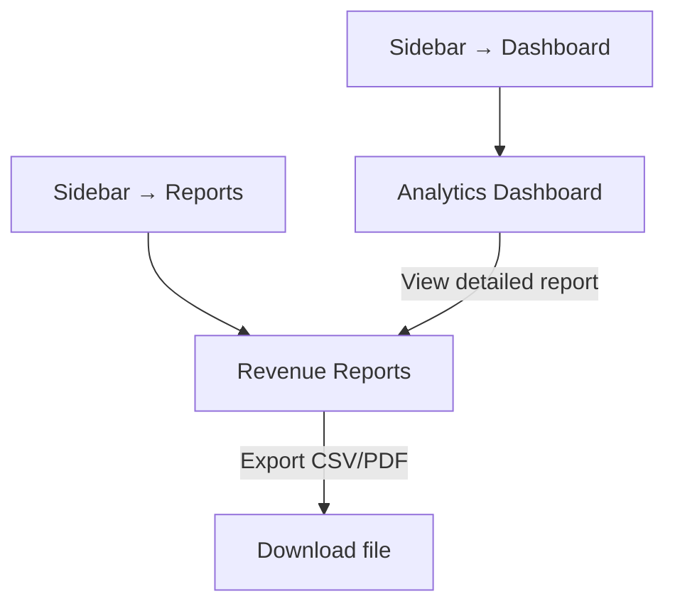

# Module 4: Reporting & Analytics

## Introduction

**Module 4: Reporting & Analytics** — Build Tier 2 (Operations)

Reporting completes the daily workflow loop: see patients (M1) → schedule next (M3) → review the day (M4). This module owns revenue reports (date-range collections, daily summaries, treatment breakdowns) and the practice analytics dashboard (trend visualization, top treatments). D-009 previously had date-range reporting, lost it when switching to MyMeds, and explicitly wants it back — a confirmed purchase driver.

### Personas

| Persona | Access Level | Primary Screens |
|---------|-------------|-----------------|
| Dentist-Owner (SW/PP) | Full access — all reports and analytics | All screens |
| Staff / Secretary | Read-only — can view reports but cannot export or modify. Solo tier: no access. Practice tier: view access. | Revenue Reports (view only) |

### Key Regulations

- **RA 10173** (Data Privacy Act 2012): Exported reports must not expose patient PII beyond what is necessary for accounting/tax. Aggregate reports show totals, not individual patient names unless explicitly requested.

## Screen Inventory

| # | Screen | Route | Spec | Wireframe |
|---|--------|-------|------|-----------|
| 1 | Revenue Reports | `/reports` | [screen-revenue-reports.md](screen-revenue-reports.md) | [wireframes/revenue-reports.xml](wireframes/revenue-reports.xml) |
| 2 | Analytics Dashboard | `/dashboard` | [screen-analytics-dashboard.md](screen-analytics-dashboard.md) | [wireframes/analytics-dashboard.xml](wireframes/analytics-dashboard.xml) |

### Collapsed into Parent Screens (not counted)

None — both screens are standalone.

## Done When

- [ ] Revenue Reports screen with date-range filtering, daily summary, and treatment breakdown
- [ ] Analytics Dashboard with trend charts and top treatments
- [ ] Reports exportable as CSV and PDF
- [ ] Dashboard loads in <2s from local database
- [ ] Practice tier gate on Analytics Dashboard (Solo tier: upgrade prompt)
- [ ] Error, empty, and loading states implemented
- [ ] Screenshots added to each screen comment by dev

## Acceptance Criteria

**Revenue Reports — Date Range:**
- GIVEN the dentist selects a custom date range
- WHEN the report generates
- THEN it shows total collections, treatments performed, and outstanding balances with breakdown by treatment type

**Revenue Reports — Daily Summary:**
- GIVEN the dentist opens the daily summary view
- WHEN the day's data loads
- THEN it shows patients seen, treatments completed, payments collected, and outstanding balances for today

**Revenue Reports — Export:**
- GIVEN a report is displayed
- WHEN the dentist taps "Export"
- THEN the report is downloadable as CSV or PDF

**Analytics Dashboard — Trends:**
- GIVEN the dentist views the dashboard
- WHEN they select a time period (weekly/monthly/quarterly)
- THEN trend visualizations update to show revenue, patient volume, and treatment frequency for that period

## Tech Notes

- **Local-first reporting** — all reports generated from local SQLite/IndexedDB. No server-side aggregation. Reports must work offline.
- **Performance** — dashboard loads in <2s. For large datasets (1000+ treatments), aggregate queries should be pre-computed or cached.
- **Export** — CSV via client-side generation (no server roundtrip). PDF via browser print-to-PDF or a lightweight client-side PDF library.
- **Charts** — use recharts via shadcn Chart component. Chart types: Line (revenue trends), Bar (top treatments), Pie (revenue breakdown). Declared in epic Charts Inventory.

## Scope Boundaries

**In scope:**
- Date-range revenue reports (custom range, daily summary)
- Treatment breakdown by type
- CSV and PDF export
- Analytics dashboard with trend charts (weekly/monthly/quarterly)
- Top treatments by frequency and revenue
- Practice overview metrics (patients seen, revenue collected, treatments performed, outstanding balances)

**Out of scope (do NOT implement):**
- Forecasting or predictive analytics — Phase 3 (FR23)
- Benchmarking against aggregate data — Phase 3 (FR23.2)
- Per-dentist revenue attribution — Phase 2 (FR16, multi-dentist)
- Real-time dashboard updates — reports reflect state at load time, not live
- Patient-level financial reports — that is Module 2 Patient Profile debt summary

---

## Navigation

### Sidebar (Navigation Shell)

| Menu Item | Route | Icon | Landing Screen |
|-----------|-------|------|----------------|
| Dashboard | `/dashboard` | `BarChart3` | Analytics Dashboard |
| Reports | `/reports` | `FileText` | Revenue Reports |

---

## Screen Flow Diagram

---

## Cross-Module Screen References

| Screen in This Module | References Screen | In Module | How |
|-----------------------|-------------------|-----------|-----|
| Revenue Reports | Patient Profile (debt) | Module 2: Patient Management | Outstanding balances aggregate from patient-level debt |
| Analytics Dashboard | Revenue Reports | This module | "View detailed report" link navigates to Reports |
| Both screens | Dental Workspace | Module 1: Dental Workspace | Treatment + payment data originates from workspace sessions |
