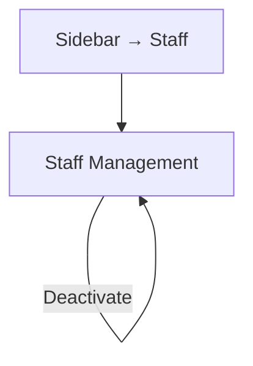

# Module 5: Staff Management

## Introduction

**Module 5: Staff Management** — Build Tier 3 (Admin & Setup)

Staff Management handles staff account creation and role-based access controls. Every Philippine dental practice has at least 1 staff member (confirmed across all research participants). Solo tier supports 1 staff login (scheduling + patient lookup only); Practice tier supports up to 3 staff logins with full operational access.

### Personas

| Persona | Access Level | Primary Screens |
|---------|-------------|-----------------|
| Dentist-Owner (SW/PP) | Full CRUD — create, edit, deactivate staff accounts, assign roles | Staff Management |
| Staff / Secretary | No access — staff cannot manage other staff accounts | — |

### Key Regulations

- **RA 10173** (Data Privacy Act 2012): Staff credentials stored securely. Access logs maintained for audit.

## Screen Inventory

| # | Screen | Route | Spec | Wireframe |
|---|--------|-------|------|-----------|
| 1 | Staff Management | `/staff` | [screen-staff-management.md](screen-staff-management.md) | Inline ASCII |

### Collapsed into Parent Screens (not counted)

None.

## Done When

- [ ] Staff Management screen with staff list and role assignment
- [ ] Solo tier: 1 staff slot. Practice tier: up to 3 staff slots.
- [ ] Role-based permissions enforced (scheduling-only vs full operational)
- [ ] Error, empty, and loading states implemented
- [ ] Screenshots added to each screen comment by dev

## Acceptance Criteria

**Staff Creation:**
- GIVEN the dentist is on the Staff Management screen
- WHEN they tap "+ Add Staff" and fill in name + role
- THEN a new staff account is created with the assigned permission set

**Tier Limits:**
- GIVEN the clinic is on Solo tier with 1 staff slot filled
- WHEN the dentist taps "+ Add Staff"
- THEN the system shows: "Solo tier supports 1 staff account. Upgrade to Practice for up to 3."

## Tech Notes

- **Permission model:** Two roles: `dentist-owner` (full access) and `staff` (scoped). Solo-tier staff: scheduling + patient lookup only. Practice-tier staff: scheduling + patients + billing + payment recording. Neither role can modify clinic settings or treatment fee schedule.
- **Credentials:** Staff log in with a PIN or password set by the dentist-owner. No email-based auth for staff (they don't need email accounts).

## Scope Boundaries

**In scope:** Staff list, create/edit/deactivate staff, role assignment, tier-based slot limits.

**Out of scope:**
- Unlimited staff logins — Phase 2 (FR16.5)
- Per-dentist staff assignment — Phase 2 (FR16, multi-dentist)
- Fine-grained per-screen permission customization — Phase 1 uses predefined role templates

---

## Navigation

### Sidebar (Navigation Shell)

| Menu Item | Route | Icon | Landing Screen |
|-----------|-------|------|----------------|
| Staff | `/staff` | `UserCog` | Staff Management |

---

## Screen Flow Diagram

---

## Cross-Module Screen References

None — Staff Management is self-contained. Other modules enforce the permissions defined here but don't link to this screen.
