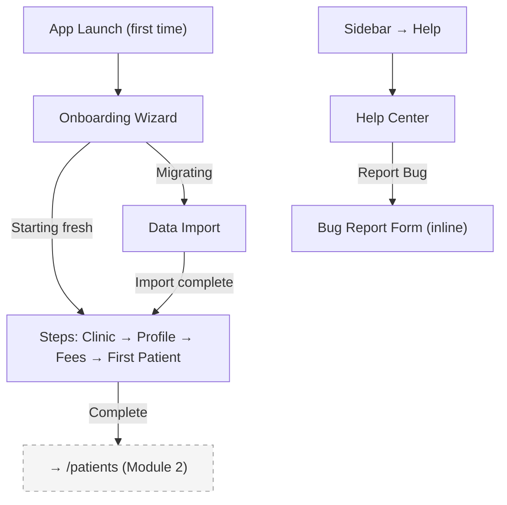

## Introduction

**Module 6: Onboarding** — Build Tier 3 (Admin & Setup)

Onboarding owns the first-run experience — the critical moment that determines whether a Paper-Pending dentist who has never used clinic software will adopt or abandon the product. It handles clinic setup, dentist profile creation, treatment fee schedule configuration, data migration routing, and the persistent help center. Designed for the Transitional majority (45-50% of the market): if onboarding requires Tech-Embracing confidence, 45% of the market is lost before they start.

### Personas

| Persona | Access Level | Primary Screens |
|---------|-------------|-----------------|
| Dentist-Owner (SW) | Full access — completes onboarding, configures fee schedule, imports data | All screens |
| Dentist-Owner (PP) | Full access — same flow but may need more guidance (Paper-Pending first-time digital user) | All screens |
| Staff / Secretary | No access to onboarding wizard or data import. Read-only access to Help Center. | Help Center only |

### Key Regulations

- **PRC Regulations**: Dentist profile setup validates PRC license number format.

## Screen Inventory

| # | Screen | Route | Spec | Wireframe |
|---|--------|-------|------|-----------|
| 1 | Onboarding Wizard | `/onboarding` | [screen-onboarding-wizard.md](screen-onboarding-wizard.md) | [wireframes/onboarding-wizard.xml](wireframes/onboarding-wizard.xml) |
| 2 | Data Import | `/onboarding/import` | [screen-data-import.md](screen-data-import.md) | Inline ASCII |
| 3 | Help Center | `/help` | [screen-help-center.md](screen-help-center.md) | Inline ASCII |

### Collapsed into Parent Screens (not counted)

None — all 3 are standalone screens.

## Done When

- [ ] Onboarding Wizard completable in <10 minutes with contextual guidance
- [ ] Data Import screen with CSV upload, validation, and error reporting
- [ ] Help Center with searchable FAQs, how-to articles, and bug reporting
- [ ] Onboarding routing: "migrating" vs "starting fresh" paths
- [ ] Dr. Lemon mascot on welcome/onboarding screens only
- [ ] Screenshots added to each screen comment by dev

## Acceptance Criteria

**Onboarding Wizard:**
- GIVEN a first-time user launches the app
- WHEN they complete the wizard (clinic setup → dentist profile → fee schedule → first patient)
- THEN setup is completable in <10 minutes with each step having contextual guidance

**Data Import:**
- GIVEN a Software Switcher selects "migrating from another system"
- WHEN they upload a CSV file
- THEN the system validates format, flags errors, and shows import progress before committing

**Help Center:**
- GIVEN any user taps Help in the sidebar
- WHEN they search for a topic
- THEN matching articles appear with relevant answers

## Tech Notes

- **Onboarding wizard state** — wizard progress persisted to local storage. If the user quits mid-wizard, they resume at the last completed step on next launch.
- **Fee schedule** — default fee schedule pre-populated with common Philippine dental procedures and market-average pricing. Dentist can modify all prices.
- **CSV import** — validate columns (name, contact, birthdate minimum). Flag rows with missing required fields. Preview before commit. Rollback on failure.
- **Help Center** — static content bundled with the app (works offline). Searchable via local full-text index.
- **Dr. Lemon** — mascot appears ONLY on onboarding/welcome screens and Help Center. Never in core app UI (dashboards, forms, clinical workflows).

## Scope Boundaries

**In scope:** Onboarding wizard (4 steps), data import (CSV), help center, bug reporting, migration routing.

**Out of scope:**
- Tutorial video library — deferred (FR13.3 content creation is a marketing task, not dev)
- CRO-assisted migration management — operational, not product UI
- In-app guided walkthrough (Dr. Lemon tips) — Phase 1 delivers the mascot on onboarding only; contextual tips throughout the app are Phase 2

---

## Navigation

### Sidebar (Navigation Shell)

| Menu Item | Route | Icon | Landing Screen |
|-----------|-------|------|----------------|
| Help | `/help` | `HelpCircle` | Help Center |

> Onboarding Wizard and Data Import are orphaned screens (no sidebar entry) — reached from first-time app launch only.

---

## Screen Flow Diagram

---

## Cross-Module Screen References

| Screen in This Module | References Screen | In Module | How |
|-----------------------|-------------------|-----------|-----|
| Onboarding Wizard (complete) | Patient List | Module 2: Patient Management | After wizard completion, redirects to Patient List |
| Data Import | Patient List | Module 2: Patient Management | Imported patients appear in Patient List |
| Onboarding Wizard | Login (first-time redirect) | Module 8: Auth | First-time detection in Login redirects to Onboarding |
