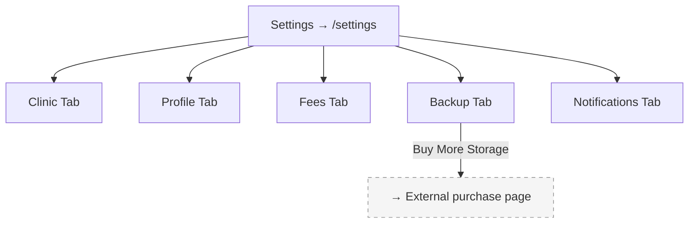

# Module 7: Settings

## Introduction

**Module 7: Settings** — Build Tier 3 (Admin & Setup)

Settings is the clinic's configuration hub — cloud backup management, data export, treatment fee schedule, notification preferences, working hours, and license/billing information. It also hosts the dentist-owner's profile management (PRC number, e-signature updates). Settings owns FR12 (offline-first + cloud backup), FR14 (transactional communication config), and FR9.8 (treatment fee schedule).

### Personas

| Persona | Access Level | Primary Screens |
|---------|-------------|-----------------|
| Dentist-Owner (SW/PP) | Full access — all settings configurable | Settings |
| Staff / Secretary | No access — Settings is dentist-owner only | — |

### Key Regulations

- **RA 10173** (Data Privacy Act 2012): Full data export (CSV/JSON) always available. Cloud backup encrypted.

## Screen Inventory

| # | Screen | Route | Spec | Wireframe |
|---|--------|-------|------|-----------|
| 1 | Settings | `/settings` | [screen-settings.md](screen-settings.md) | [wireframes/settings.xml](wireframes/settings.xml) |

### Collapsed into Parent Screens (not counted)

None — Settings uses tabs/sections within a single screen.

## Done When

- [ ] Settings screen with all configuration sections
- [ ] Cloud backup status + storage usage visible
- [ ] Treatment fee schedule editable
- [ ] Working hours configurable (for scheduling slot generation)
- [ ] Data export (CSV/JSON) functional
- [ ] Dentist-owner only (staff see access denied)
- [ ] Screenshots added to each screen comment by dev

## Acceptance Criteria

**Cloud Backup:**
- GIVEN the dentist views cloud backup settings
- WHEN backup is active
- THEN they see: last backup date, storage used/remaining, sync status indicator

**Fee Schedule:**
- GIVEN the dentist edits a treatment price
- WHEN they save
- THEN the new price applies to future treatments (not retroactively)

## Tech Notes

- **Cloud backup** — automatic daily backup when connected. 20 GB included. Storage expansion via one-time purchase blocks. "Cloud Backup" framing — never "Cloud Storage."
- **Fee schedule changes** — apply prospectively only. Existing breakdown table rows keep their original prices.
- **Working hours** — default 8:00 AM – 6:00 PM. Configurable start/end time + slot duration (30 min default). Used by Module 3 (Scheduling) for time slot generation.

## Scope Boundaries

**In scope:** Cloud backup config, storage monitoring, data export, fee schedule, working hours, notification preferences, dentist profile (PRC, signature), license info.

**Out of scope:**
- Payment/billing management for the license itself — handled externally
- Storage expansion purchase flow — links to external purchase page
- Staff management — that is Module 5

---

## Navigation

### Sidebar (Navigation Shell)

| Menu Item | Route | Icon | Landing Screen |
|-----------|-------|------|----------------|
| Settings | `/settings` | `Settings` | Settings |

---

## Screen Flow Diagram

---

## Cross-Module Screen References

| Screen in This Module | References Screen | In Module | How |
|-----------------------|-------------------|-----------|-----|
| Settings (fee schedule) | Dental Workspace | Module 1 | Fee schedule prices auto-fill in breakdown table |
| Settings (working hours) | Calendar | Module 3 | Working hours define available time slots |
