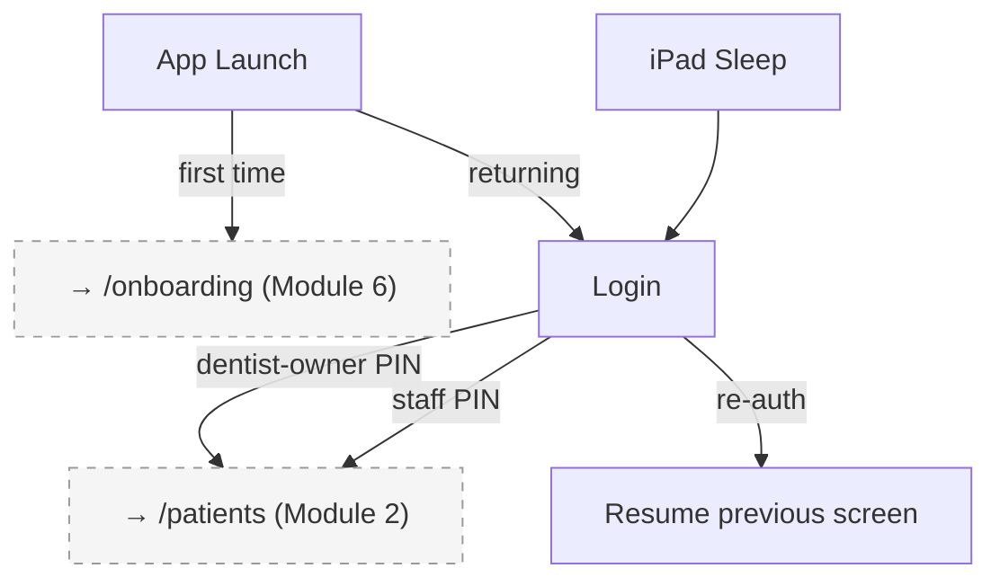

## Introduction

**Module 8: Auth** — Build Tier 3 (Admin & Setup)

Auth handles login for the dentist-owner and staff. This is the app's entry gate — simple PIN/password authentication for a local-first, single-device app. No cloud auth, no OAuth, no email verification. The dentist-owner creates their account during onboarding (Module 6); staff accounts are created in Staff Management (Module 5).

### Personas

| Persona | Access Level | Primary Screens |
|---------|-------------|-----------------|
| Dentist-Owner | Full access after login | Login |
| Staff | Scoped access after login (per Module 5 role) | Login |

### Key Regulations

- **RA 10173** (Data Privacy Act 2012): Credentials stored securely (hashed). Session locked on auto-sleep.

## Screen Inventory

| # | Screen | Route | Spec | Wireframe |
|---|--------|-------|------|-----------|
| 1 | Login | `/login` | [screen-login.md](screen-login.md) | Inline ASCII |

### Collapsed into Parent Screens (not counted)

None.

## Done When

- [ ] Login screen with user selection (dentist-owner + staff accounts) and PIN/password entry
- [ ] Auto-lock on iPad sleep with re-authentication required
- [ ] First-time launch → redirects to Onboarding Wizard (Module 6) instead of Login
- [ ] Error, empty, and loading states implemented
- [ ] Screenshots added to each screen comment by dev

## Acceptance Criteria

**Login:**
- GIVEN the app launches (not first time)
- WHEN the login screen appears
- THEN the dentist-owner and any active staff accounts are shown as selectable user cards with PIN entry

**Auto-Lock:**
- GIVEN the iPad auto-locks during a session
- WHEN the dentist unlocks the iPad
- THEN the login screen appears with the last-active user pre-selected, and the app resumes at the exact screen after successful re-authentication

## Tech Notes

- **Local auth only** — no server-side authentication. PIN/password validated against local hashed credential. No internet required.
- **Auto-lock** — on iPad sleep event, session is locked. On wake: login screen appears. After successful PIN entry: app resumes at the exact previous screen (including workspace with all state preserved).
- **First-time detection** — if no dentist-owner account exists in local database, redirect to `/onboarding` instead of showing login.
- **Brute-force protection** — after 5 failed PIN attempts: lock for 30 seconds. After 10: lock for 5 minutes.

## Scope Boundaries

**In scope:** Login screen, PIN/password entry, user selection, auto-lock/re-auth, first-time redirect to onboarding.

**Out of scope:**
- Cloud-based authentication — local only
- Biometric auth (Face ID/Touch ID) — Phase 2 enhancement
- Password reset via email — N/A for local auth
- Multi-device session management — single-device only

---

## Navigation

### Pre-Auth (no nav)

Login is the entry point. No sidebar or tab bar. After successful authentication → redirects to Patient List (`/patients`).

---

## Screen Flow Diagram

---

## Cross-Module Screen References

| Screen in This Module | References Screen | In Module | How |
|-----------------------|-------------------|-----------|-----|
| Login (first time) | Onboarding Wizard | Module 6: Onboarding | First-time redirect |
| Login (success) | Patient List | Module 2: Patient Management | Post-login landing page |
| Login (re-auth) | Previous screen | Any module | Resumes exact state after iPad sleep re-authentication |
